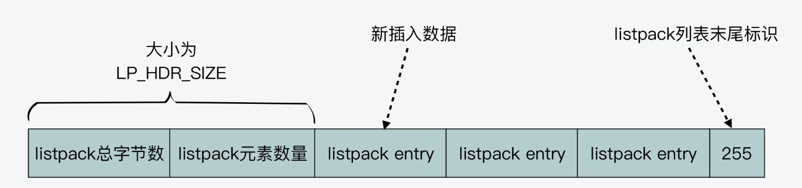
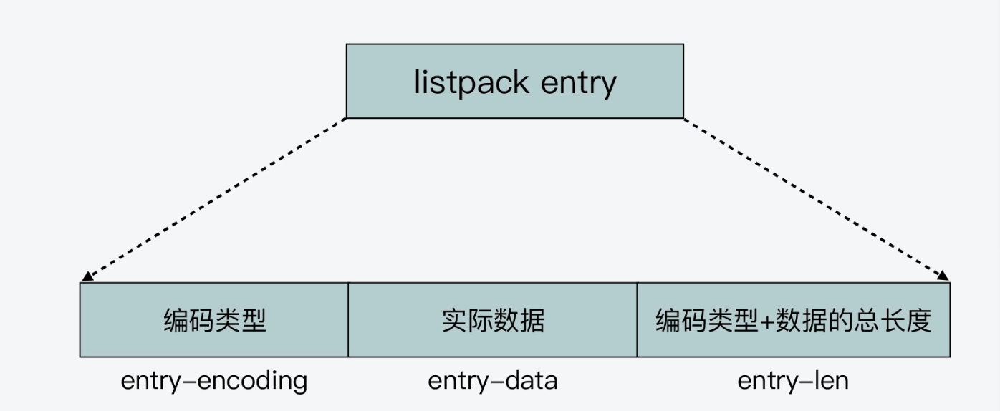
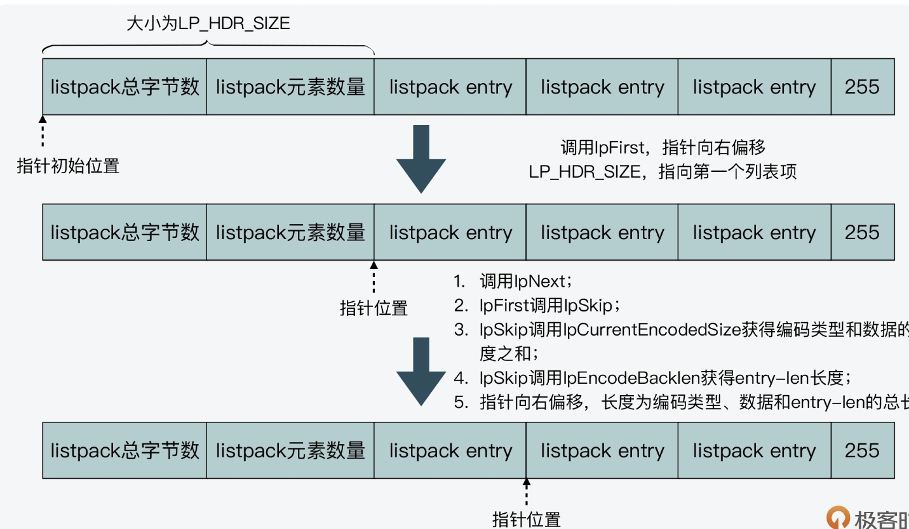
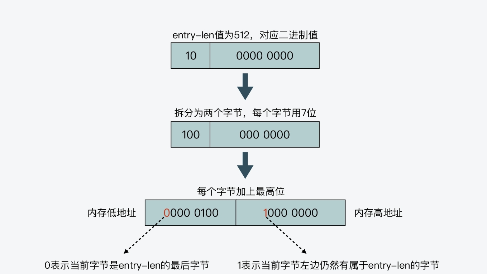

# redis中的数据结构
## 紧凑列表（listpack）
### 一、结构
listpack和ziplist类似，没有直接的结构定义，但是可以从创建函数中了解其结构。
lpNew 函数创建了一个空的 listpack，一开始分配的大小是 LP_HDR_SIZE 再加 1 个字节。LP_HDR_SIZE 宏定义是在 listpack.c 中，它默认是 6 个字节，其中 4 个字节是记录 listpack 的总字节数，2 个字节是记录 listpack 的元素数量
此外，listpack 的最后一个字节是用来标识 listpack 的结束，其默认值是宏定义 LP_EOF。和 ziplist 列表项的结束标记一样，LP_EOF 的值也是 255
由此可见，listpack和ziplist一样采用连续内存空间存储来减少内存的占用。
```c
/* 创建一个新的空listpack
 * 成功返回新创建的listpack，否则返回错误信息或者null
 * 预分配至少 `capacity` 字节的内存,
 * 过量分配的内存可以通过lpShrinkToFit函数进行回收
 * */
unsigned char *lpNew(void) {
    //分配LP_HRD_SIZE+1
    unsigned char *lp = lp_malloc(LP_HDR_SIZE+1);
    if (lp == NULL) return NULL;
    //设置listpack的大小
    lpSetTotalBytes(lp,LP_HDR_SIZE+1);
    //设置listpack的元素个数，初始值为0
    lpSetNumElements(lp,0);
    //设置listpack的结尾标识为LP_EOF，值为255
    lp[LP_HDR_SIZE] = LP_EOF;
    return lp;
}
```
示意图：

listpack的列表项包含了元数据信息和数据，并且为了避免ziplist的连锁更新问题，每个列表项不在保存前一项的长度。
listpack的列表项通过编码的方式存储了元素的：编码类型、元素数据、被骂类型+数据长度。
示意图：

### 二、特性
#### 2.1 listpack列表项的内存友好设计
在listpack.c文件中，存在大量携带ENCODING的宏定义，参考如下。
下方宏定义针对不同元素的不同长度进行了编码。
举例#define LP_ENCODING_7BIT_UINT 0,定义表示无符号整数，因此定义本身为0，占用数据的一个bit作为编码。
0xxx xxxx,收个bit 0表示无符号整数，剩下7位用于存储数据，最大可以存储2^7=128
举例#define LP_ENCODING_12BIT_STR 0xE0，定义了12长度的字符串，定义本身为0xE0,二进制位1110 0000，因为定义了12bit,
因此1110为定义头，后面的0000和一个新的字节0000 0000组成了12位数据存储位，长度不超过4095的字符串。
其他的定义根据宏描述的长度和头以此类推。
```c
#define LP_ENCODING_INT 0
#define LP_ENCODING_STRING 1

#define LP_ENCODING_7BIT_UINT 0
#define LP_ENCODING_7BIT_UINT_MASK 0x80
#define LP_ENCODING_IS_7BIT_UINT(byte) (((byte)&LP_ENCODING_7BIT_UINT_MASK)==LP_ENCODING_7BIT_UINT)
#define LP_ENCODING_7BIT_UINT_ENTRY_SIZE 2

#define LP_ENCODING_6BIT_STR 0x80
#define LP_ENCODING_6BIT_STR_MASK 0xC0
#define LP_ENCODING_IS_6BIT_STR(byte) (((byte)&LP_ENCODING_6BIT_STR_MASK)==LP_ENCODING_6BIT_STR)

#define LP_ENCODING_13BIT_INT 0xC0
#define LP_ENCODING_13BIT_INT_MASK 0xE0
#define LP_ENCODING_IS_13BIT_INT(byte) (((byte)&LP_ENCODING_13BIT_INT_MASK)==LP_ENCODING_13BIT_INT)
#define LP_ENCODING_13BIT_INT_ENTRY_SIZE 3

#define LP_ENCODING_12BIT_STR 0xE0
#define LP_ENCODING_12BIT_STR_MASK 0xF0
#define LP_ENCODING_IS_12BIT_STR(byte) (((byte)&LP_ENCODING_12BIT_STR_MASK)==LP_ENCODING_12BIT_STR)

#define LP_ENCODING_16BIT_INT 0xF1
#define LP_ENCODING_16BIT_INT_MASK 0xFF
#define LP_ENCODING_IS_16BIT_INT(byte) (((byte)&LP_ENCODING_16BIT_INT_MASK)==LP_ENCODING_16BIT_INT)
#define LP_ENCODING_16BIT_INT_ENTRY_SIZE 4

#define LP_ENCODING_24BIT_INT 0xF2
#define LP_ENCODING_24BIT_INT_MASK 0xFF
#define LP_ENCODING_IS_24BIT_INT(byte) (((byte)&LP_ENCODING_24BIT_INT_MASK)==LP_ENCODING_24BIT_INT)
#define LP_ENCODING_24BIT_INT_ENTRY_SIZE 5

#define LP_ENCODING_32BIT_INT 0xF3
#define LP_ENCODING_32BIT_INT_MASK 0xFF
#define LP_ENCODING_IS_32BIT_INT(byte) (((byte)&LP_ENCODING_32BIT_INT_MASK)==LP_ENCODING_32BIT_INT)
#define LP_ENCODING_32BIT_INT_ENTRY_SIZE 6

#define LP_ENCODING_64BIT_INT 0xF4
#define LP_ENCODING_64BIT_INT_MASK 0xFF
#define LP_ENCODING_IS_64BIT_INT(byte) (((byte)&LP_ENCODING_64BIT_INT_MASK)==LP_ENCODING_64BIT_INT)
#define LP_ENCODING_64BIT_INT_ENTRY_SIZE 10

#define LP_ENCODING_32BIT_STR 0xF0
#define LP_ENCODING_32BIT_STR_MASK 0xFF
#define LP_ENCODING_IS_32BIT_STR(byte) (((byte)&LP_ENCODING_32BIT_STR_MASK)==LP_ENCODING_32BIT_STR)

#define LP_ENCODING_6BIT_STR_LEN(p) ((p)[0] & 0x3F)
#define LP_ENCODING_12BIT_STR_LEN(p) ((((p)[0] & 0xF) << 8) | (p)[1])
#define LP_ENCODING_32BIT_STR_LEN(p) (((uint32_t)(p)[1]<<0) | \
                                      ((uint32_t)(p)[2]<<8) | \
                                      ((uint32_t)(p)[3]<<16) | \
                                      ((uint32_t)(p)[4]<<24))
```
#### 2.2 避免连锁更新
每个listpack的项只会存储自己的编码+数据+长度，不会包含前一项的长度，因此只需要指针操作进行偏移和插入、删除数据即可，不会影响其他项，因此不会产生连锁更新。

#### 3.2 分配内存
每次添加列表项依旧需要重新分配内存，因为listpack是内存连续的结构设计。

### 三、部分函数代码
#### 3.1 listpack正向查找
listpack中查找元素的函数如下（根据给定元素序号index查找）
```c
/* 查找指定元素并返回指向该元素的指针。
 * 正索引从头到尾指定零起始的元素位置，负索引从尾部开始指定元素位置，
 * 其中 -1 表示最后一个元素，-2 表示倒数第二个元素，依此类推。如果索引超出范围，则返回 NULL。 */
unsigned char *lpSeek(unsigned char *lp, long index) {
    int forward = 1; /* 默认向前查找。 */

    /* 获取列表包的元素数量。 */
    uint32_t numele = lpGetNumElements(lp);

    /* 如果列表包长度已知，则根据索引和列表包长度确定查找方向。 */
    if (numele != LP_HDR_NUMELE_UNKNOWN) {
        if (index < 0) index = (long)numele+index;
        if (index < 0) return NULL; /* 如果索引仍 < 0，则超出范围。 */
        if (index >= (long)numele) return NULL; /* 超出范围的另一侧。 */

        /* 如果要查找的元素在列表包的一半之后，我们想从右到左扫描。 */
        if (index > (long)numele/2) {
            forward = 0;
            /* 从右到左扫描始终期望负索引。将我们的索引转换为负数形式。 */
            index -= numele;
        }
    } else {
        /* 如果列表包长度未指定，则对于负索引，我们总是想从右到左扫描。 */
        if (index < 0) forward = 0;
    }

    /* 向前和向后扫描基于 lpNext()/lpPrev() 函数。 */
    if (forward) {
        unsigned char *ele = lpFirst(lp);
        while (index > 0 && ele) {
            ele = lpNext(lp,ele);
            index--;
        }
        return ele;
    } else {
        unsigned char *ele = lpLast(lp);
        while (index < -1 && ele) {
            ele = lpPrev(lp,ele);
            index++;
        }
        return ele;
    }
}
```
上述方法中，lpFirst + lpNext完成正向查找。

lpFirst函数
```c
/* 返回指向列表包的第一个元素的指针，如果列表包没有元素，则返回 NULL。 */
unsigned char *lpFirst(unsigned char *lp) {
    unsigned char *p = lp + LP_HDR_SIZE; /* 跳过头部。 */
    if (p[0] == LP_EOF) return NULL; /* 如果指向 EOF，则列表包为空。 */
    lpAssertValidEntry(lp, lpBytes(lp), p); /* 断言当前指针指向的条目有效。 */
    return p;
}
```

lpNext函数
```c
/* 如果 'p' 指向列表包的一个元素，则调用 lpNext() 将返回指向下一个元素（右侧的元素）的指针，
 * 如果 'p' 已经指向列表包的最后一个元素，则返回 NULL。 */
unsigned char *lpNext(unsigned char *lp, unsigned char *p) {
    assert(p); /* 断言 'p' 不为 NULL。 */
    p = lpSkip(p); /* 跳到下一个元素。 */
    if (p[0] == LP_EOF) return NULL; /* 如果指向 EOF，则已到达列表包末尾。 */
    lpAssertValidEntry(lp, lpBytes(lp), p); /* 断言当前指针指向的条目有效。 */
    return p;
}
```
lpSkip函数
```c
/* 跳过当前条目并返回下一个条目的指针。
   如果当前元素是列表包末尾的 EOF 元素，则调用此函数是无效的；
   然而，虽然此函数用于实现 lpNext()，但在遇到 EOF 元素时，它不会返回 NULL。 */
unsigned char *lpSkip(unsigned char *p) {
    unsigned long entrylen = lpCurrentEncodedSizeUnsafe(p); /* 获取当前条目的编码长度。*/
    entrylen += lpEncodeBacklen(NULL, entrylen); /* 计算并添加前缀长度到总长度。 */
    p += entrylen; /* 移动指针到下一个条目。 */
    return p;
}


/* 返回指针 'p' 指向的列表包元素的编码长度。
 * 这包括编码字节、长度字节和元素数据本身。
 * 如果元素编码错误，则返回 0。
 * 请注意，此方法可能访问额外的字节（在 12 位和 32 位 str 的情况下），
 * 因此应仅在我们知道 'p' 已由 lpCurrentEncodedSizeBytes 或 ASSERT_INTEGRITY_LEN
 * 进行验证时才调用（可能是因为 'p' 是另一个函数的返回值，该函数验证了其返回值）。
 */
static inline uint32_t lpCurrentEncodedSizeUnsafe(unsigned char *p) {
    if (LP_ENCODING_IS_7BIT_UINT(p[0])) return 1; /* 7 位无符号整数编码。*/
    if (LP_ENCODING_IS_6BIT_STR(p[0])) return 1+LP_ENCODING_6BIT_STR_LEN(p); /* 6 位字符串编码。 */
    if (LP_ENCODING_IS_13BIT_INT(p[0])) return 2; /* 13 位整数编码。 */
    if (LP_ENCODING_IS_16BIT_INT(p[0])) return 3; /* 16 位整数编码。 */
    if (LP_ENCODING_IS_24BIT_INT(p[0])) return 4; /* 24 位整数编码。 */
    if (LP_ENCODING_IS_32BIT_INT(p[0])) return 5; /* 32 位整数编码。 */
    if (LP_ENCODING_IS_64BIT_INT(p[0])) return 9; /* 64 位整数编码。 */
    if (LP_ENCODING_IS_12BIT_STR(p[0])) return 2+LP_ENCODING_12BIT_STR_LEN(p); /* 12 位字符串编码。 */
    if (LP_ENCODING_IS_32BIT_STR(p[0])) return 5+LP_ENCODING_32BIT_STR_LEN(p); /* 32 位字符串编码。 */
    if (p[0] == LP_EOF) return 1; /* EOF 编码。 */
    return 0; /* 如果编码错误，则返回 0。 */
}

/* 将反向编码的变长字段，表示大小为 'l' 的前一个元素的长度，存储在目标缓冲区 'buf' 中。
 * 函数返回用于编码的字节数，从 1 到 5。如果 'buf' 为 NULL，则函数只返回编码 backlen 所需的字节数。
 */
static inline unsigned long lpEncodeBacklen(unsigned char *buf, uint64_t l) {
    if (l <= 127) { /* 如果长度小于等于 127，则使用一个字节编码。 */
        if (buf) buf[0] = l; /* 存储编码结果到缓冲区。 */
        return 1; /* 返回编码的字节数。 */
    } else if (l < 16383) { /* 如果长度小于 16383，则使用两个字节编码。 */
        if (buf) {
            buf[0] = l >> 7; /* 高 7 位存储到第一个字节中。 */
            buf[1] = (l & 127) | 128; /* 低 7 位存储到第二个字节中，并设置最高位为 1。 */
        }
        return 2; /* 返回编码的字节数。 */
    } else if (l < 2097151) { /* 如果长度小于 2097151，则使用三个字节编码。 */
        if (buf) {
            buf[0] = l >> 14; /* 高 7 位存储到第一个字节中。 */
            buf[1] = ((l >> 7) & 127) | 128; /* 中间 7 位存储到第二个字节中，并设置最高位为 1。 */
            buf[2] = (l & 127) | 128; /* 低 7 位存储到第三个字节中，并设置最高位为 1。 */
        }
        return 3; /* 返回编码的字节数。 */
    } else if (l < 268435455) { /* 如果长度小于 268435455，则使用四个字节编码。 */
        if (buf) {
            buf[0] = l >> 21; /* 高 7 位存储到第一个字节中。 */
            buf[1] = ((l >> 14) & 127) | 128; /* 中间的 7 位存储到第二个字节中，并设置最高位为 1。 */
            buf[2] = ((l >> 7) & 127) | 128; /* 中间的 7 位存储到第三个字节中，并设置最高位为 1。 */
            buf[3] = (l & 127) | 128; /* 低 7 位存储到第四个字节中，并设置最高位为 1。 */
        }
        return 4; /* 返回编码的字节数。 */
    } else { /* 如果长度大于等于 268435455，则使用五个字节编码。 */
        if (buf) {
            buf[0] = l >> 28; /* 高 4 位存储到第一个字节中。 */
            buf[1] = ((l >> 21) & 127) | 128; /* 中间的 7 位存储到第二个字节中，并设置最高位为 1。 */
            buf[2] = ((l >> 14) & 127) | 128; /* 中间的 7 位存储到第三个字节中，并设置最高位为 1。 */
            buf[3] = ((l >> 7) & 127) | 128; /* 中间的 7 位存储到第四个字节中，并设置最高位为 1。 */
            buf[4] = (l & 127) | 128; /* 低 7 位存储到第五个字节中，并设置最高位为 1。 */
        }
        return 5; /* 返回编码的字节数。 */
    }
}

```
正向查找示意图：

#### 3.2 listpack反向查找
3.1的lpseek中，lpLast + lpPrev 组合完成反向查找。  
lpLast函数
```c
/* 返回指向列表包的最后一个元素的指针，如果列表包没有元素，则返回 NULL。 */
unsigned char *lpLast(unsigned char *lp) {
    unsigned char *p = lp + lpGetTotalBytes(lp) - 1; /* 定位到 EOF 元素。 */
    return lpPrev(lp, p); /* 如果 EOF 是唯一元素，则返回 NULL。 */
}
```
lpGetTotalBytes宏定义
```c
/* 宏函数：返回指向列表包的总字节数。

   参数 'p' 是指向列表包的指针。

   宏将列表包的总字节数计算为 4 个字节的无符号整数，以大端字节序表示。
   最高有效字节位于索引 0 处，最低有效字节位于索引 3 处。

   返回值是列表包的总字节数（无符号 32 位整数）。 */
#define lpGetTotalBytes(p)           (((uint32_t)(p)[0]<<0) | \
                                      ((uint32_t)(p)[1]<<8) | \
                                      ((uint32_t)(p)[2]<<16) | \
                                      ((uint32_t)(p)[3]<<24))

```

lpPrev函数
lpPrev函数中的关键一步就是调用lpDecodeBacklen函数。  
lpDecodeBacklen函数会从右向左，逐个字节地读取当前列表项的entry-len。  
lpDecodeBacklen依赖于entry-len的编码方式判断entry-len的结束：  
entry-len每个字节的最高位，是用来表示当前字节是否为entry-len的最后一个字节，且两种情况：  
- 最高位为1，表示entry-len还没有结束，当前字节的左边字节仍然表示entry-len的内容；  
- 最高位为0，表示当前字节已经是entry-len最后一个字节了。而entry-len每个字节的低7位，则记录了实际的长度信息。  
需要注意的是，entry-len每个字节的低7位采用了大端模式存储，即entry-len的低位字节保存在内存高地址上。参考下图
编码方式示意图：
```c
/* 如果 'p' 指向列表包的一个元素，则调用 lpPrev() 将返回指向前一个元素（左侧的元素）的指针，
 * 如果 'p' 已经指向列表包的第一个元素，则返回 NULL。 */
unsigned char *lpPrev(unsigned char *lp, unsigned char *p) {
    assert(p); /* 断言 'p' 不为 NULL。 */
    if (p - lp == LP_HDR_SIZE) return NULL; /* 如果 'p' 指向列表包的第一个元素，则返回 NULL。 */
    p--; /* 定位到最后一个元素的第一个 backlen 字节。 */
    uint64_t prevlen = lpDecodeBacklen(p); /* 解码前一个元素的长度。 */
    prevlen += lpEncodeBacklen(NULL, prevlen); /* 计算并添加前一个元素的 backlen 到总长度。 */
    p -= prevlen - 1; /* 定位到前一个条目的第一个字节。 */
    lpAssertValidEntry(lp, lpBytes(lp), p); /* 断言当前指针指向的条目有效。 */
    return p; /* 返回指向前一个元素的指针。 */
}

/* 解码 backlen 并返回其值。如果编码看起来无效（使用了超过 5 个字节），则返回 UINT64_MAX 以报告问题。 */
static inline uint64_t lpDecodeBacklen(unsigned char *p) {
    uint64_t val = 0; /* 初始化解码结果。*/
    uint64_t shift = 0; /* 初始化位移值。*/
    do {
        val |= (uint64_t)(p[0] & 127) << shift; /* 将每个字节的低 7 位解码并添加到结果中。 */
        if (!(p[0] & 128)) break; /* 如果字节的最高位为 0，则表示解码完成。 */
        shift += 7; /* 更新位移值。 */
        p--; /* 移动到前一个字节。 */
        if (shift > 28) return UINT64_MAX; /* 如果位移值超过 28 位，则返回 UINT64_MAX，表示编码无效。 */
    } while(1); /* 循环直到解码完成。 */
    return val; /* 返回解码后的 backlen。 */
}

/* 将反向编码的变长字段，表示大小为 'l' 的前一个元素的长度，存储在目标缓冲区 'buf' 中。
 * 函数返回用于编码的字节数，从 1 到 5。如果 'buf' 为 NULL，则函数只返回编码 backlen 所需的字节数。
 */
static inline unsigned long lpEncodeBacklen(unsigned char *buf, uint64_t l) {
    if (l <= 127) { /* 如果长度小于等于 127，则使用一个字节编码。 */
        if (buf) buf[0] = l; /* 存储编码结果到缓冲区。 */
        return 1; /* 返回编码的字节数。 */
    } else if (l < 16383) { /* 如果长度小于 16383，则使用两个字节编码。 */
        if (buf) {
            buf[0] = l >> 7; /* 高 7 位存储到第一个字节中。 */
            buf[1] = (l & 127) | 128; /* 低 7 位存储到第二个字节中，并设置最高位为 1。 */
        }
        return 2; /* 返回编码的字节数。 */
    } else if (l < 2097151) { /* 如果长度小于 2097151，则使用三个字节编码。 */
        if (buf) {
            buf[0] = l >> 14; /* 高 7 位存储到第一个字节中。 */
            buf[1] = ((l >> 7) & 127) | 128; /* 中间 7 位存储到第二个字节中，并设置最高位为 1。 */
            buf[2] = (l & 127) | 128; /* 低 7 位存储到第三个字节中，并设置最高位为 1。 */
        }
        return 3; /* 返回编码的字节数。 */
    } else if (l < 268435455) { /* 如果长度小于 268435455，则使用四个字节编码。 */
        if (buf) {
            buf[0] = l >> 21; /* 高 7 位存储到第一个字节中。 */
            buf[1] = ((l >> 14) & 127) | 128; /* 中间的 7 位存储到第二个字节中，并设置最高位为 1。 */
            buf[2] = ((l >> 7) & 127) | 128; /* 中间的 7 位存储到第三个字节中，并设置最高位为 1。 */
            buf[3] = (l & 127) | 128; /* 低 7 位存储到第四个字节中，并设置最高位为 1。 */
        }
        return 4; /* 返回编码的字节数。 */
    } else { /* 如果长度大于等于 268435455，则使用五个字节编码。 */
        if (buf) {
            buf[0] = l >> 28; /* 高 4 位存储到第一个字节中。 */
            buf[1] = ((l >> 21) & 127) | 128; /* 中间的 7 位存储到第二个字节中，并设置最高位为 1。 */
            buf[2] = ((l >> 14) & 127) | 128; /* 中间的 7 位存储到第三个字节中，并设置最高位为 1。 */
            buf[3] = ((l >> 7) & 127) | 128; /* 中间的 7 位存储到第四个字节中，并设置最高位为 1。 */
            buf[4] = (l & 127) | 128; /* 低 7 位存储到第五个字节中，并设置最高位为 1。 */
        }
        return 5; /* 返回编码的字节数。 */
    }
}
```

#### 3.3 listpack添加项
```c
/* 在指定位置 'p' 处插入、删除或替换长度为 'size' 的字符串元素 'elestr' 或整数元素 'eleint'，
 * 'p' 是通过 lpFirst()、lpLast()、lpNext()、lpPrev() 或 lpSeek() 获取的 listpack 元素指针。
 *
 * 根据 'where' 参数，元素将插入、插入到后面或替换 'p' 指向的元素，'where' 可以是 LP_BEFORE、LP_AFTER
 * 或 LP_REPLACE。
 * 
 * 如果 'elestr' 和 'eleint' 都为 NULL，则函数会删除 'p' 指向的元素而不是插入。
 * 如果 'eleint' 非空，则 'size' 是 'eleint' 的长度，函数会插入或替换为一个64位整数，存储在 'eleint' 缓冲区中。
 * 如果 'elestr` 非空，则 'size' 是 'elestr' 的长度，函数会插入或替换为一个字符串，存储在 'elestr' 缓冲区中。
 * 
 * 当内存不足或 listpack 总长度超过最大允许大小 2^32-1 时，返回 NULL；否则返回包含新元素的 listpack 的新指针（旧指针不再有效）。
 *
 * 如果 'newp' 非空，则在成功调用结束时 '*newp' 将被设置为刚添加的元素的地址，这样可以继续使用 lpNext() 和 lpPrev() 进行交互。
 *
 * 对于删除操作（'elestr' 和 'eleint' 均设置为 NULL），'newp' 被设置为删除元素右侧的下一个元素，如果被删除的元素是最后一个，则设置为 NULL。 */
unsigned char *lpInsert(unsigned char *lp, unsigned char *elestr, unsigned char *eleint,
                        uint32_t size, unsigned char *p, int where, unsigned char **newp)
{
    unsigned char intenc[LP_MAX_INT_ENCODING_LEN]; // 存储整数编码后的字符串
    unsigned char backlen[LP_MAX_BACKLEN_SIZE]; // 存储反向可解析长度编码后的字符串

    uint64_t enclen; /* 编码元素的长度。*/
    int delete = (elestr == NULL && eleint == NULL); // 标记是否删除操作

    /* 当删除操作时，概念上是用零长度元素替换原元素。因此，无论传递的 'where' 是什么，都将其设置为 LP_REPLACE。 */
    if (delete) where = LP_REPLACE;

    /* 如果需要在当前元素之后插入，我们只需跳到下一个元素（可能是 EOF 元素）并处理在之前插入的情况。
     * 因此，函数实际上只处理两种情况：LP_BEFORE 和 LP_REPLACE。 */
    if (where == LP_AFTER) {
        p = lpSkip(p);
        where = LP_BEFORE;
        ASSERT_INTEGRITY(lp, p); // 断言 listpack 的完整性
    }

    /* 存储元素 'p' 的偏移量，以便在重新分配后可以再次获取其地址。 */
    unsigned long poff = p - lp;

    int enctype;
    if (elestr) {
        /* 调用 lpEncodeGetType() 会导致编码的版本（如果可以表示为整数）存储在 'intenc' 中：
         * 在这种情况下，函数返回 LP_ENCODING_INT。
         * 否则，如果返回 LP_ENCODING_STR，则需要调用 lpEncodeString() 来实际在后面写入编码后的字符串。
         *
         * 无论返回的编码是什么，'enclen' 都会得到编码后元素的长度。*/
        enctype = lpEncodeGetType(elestr, size, intenc, &enclen);
        if (enctype == LP_ENCODING_INT) eleint = intenc;
    } else if (eleint) {
        enctype = LP_ENCODING_INT;
        enclen = size; /* 'size' 是编码整数元素的长度。 */
    } else {
        enctype = -1;
        enclen = 0;
    }

    /* 我们还需要编码元素的反向可解析长度并将其追加到末尾：这允许从后往前遍历 listpack。*/
    unsigned long backlen_size = (!delete) ? lpEncodeBacklen(backlen, enclen) : 0;
    uint64_t old_listpack_bytes = lpGetTotalBytes(lp);
    uint32_t replaced_len = 0;
    if (where == LP_REPLACE) {
        replaced_len = lpCurrentEncodedSizeUnsafe(p);
        replaced_len += lpEncodeBacklen(NULL, replaced_len);
        ASSERT_INTEGRITY_LEN(lp, p, replaced_len);
    }

    uint64_t new_listpack_bytes = old_listpack_bytes + enclen + backlen_size
                                  - replaced_len;
    if (new_listpack_bytes > UINT32_MAX) return NULL;

    /* 我们现在需要重新分配以腾出空间或缩小分配（如果 'when' 值为 LP_REPLACE 并且新元素较小）。
     * 但是在 memmove 内存以为新元素腾出空间之前，如果最终分配将变大，则在重新分配之前进行，
     * 或者如果最终分配将变小，则在 memmove 之后进行。 */

    unsigned char *dst = lp + poff; /* 可能在重新分配后更新。 */

    /* 在之前重新分配：我们需要更多空间。*/
    if (new_listpack_bytes > old_listpack_bytes &&
        new_listpack_bytes > lp_malloc_size(lp)) {
        if ((lp = lp_realloc(lp, new_listpack_bytes)) == NULL) return NULL;
        dst = lp + poff;
    }

    /* 设置 listpack 以移动元素，为新元素腾出所需的空间。*/
    if (where == LP_BEFORE) {
        memmove(dst + enclen + backlen_size, dst, old_listpack_bytes - poff);
    } else { /* LP_REPLACE. */
        memmove(dst + enclen + backlen_size,
                dst + replaced_len,
                old_listpack_bytes - poff - replaced_len);
    }

    /* 在之后重新分配：我们需要释放空间。*/
    if (new_listpack_bytes < old_listpack_bytes) {
        if ((lp = lp_realloc(lp, new_listpack_bytes)) == NULL) return NULL;
        dst = lp + poff;
    }

    /* 存储条目。*/
    if (newp) {
        *newp = dst;
        /* 在删除操作中，如果下一个元素是 EOF 元素，则将 'newp' 设置为 NULL。 */
        if (delete && dst[0] == LP_EOF) *newp = NULL;
    }
    if (!delete) {
        if (enctype == LP_ENCODING_INT) {
            memcpy(dst, eleint, enclen);
        } else if (elestr) {
            lpEncodeString(dst, elestr, size);
        } else {
            redis_unreachable(); // 不可达的代码，表示发生了无法预料的错误
        }
        dst += enclen;
        memcpy(dst, backlen, backlen_size);
        dst += backlen_size;
    }

    /* 更新头部。 */
    if (where != LP_REPLACE || delete) {
        uint32_t num_elements = lpGetNumElements(lp);
        if (num_elements != LP_HDR_NUMELE_UNKNOWN) {
            if (!delete)
                lpSetNumElements(lp, num_elements + 1);
            else
                lpSetNumElements(lp, num_elements - 1);
        }
    }
    lpSetTotalBytes(lp, new_listpack_bytes);

#if 0
    /* 此代码通常被禁用：它会强制 listpack 在执行一些修改 listpack 的操作后始终返回一个新指针，
     * 即使之前的分配足够。这对于发现使用 listpack 的代码中的错误很有用：
     * 通过这样做，我们可以发现调用者在更新后忘记将新指针设置到存储 listpack 引用的位置的情况。*/
    unsigned char *oldlp = lp;
    lp = lp_malloc(new_listpack_bytes);
    memcpy(lp, oldlp, new_listpack_bytes);
    if (newp) {
        unsigned long offset = (*newp) - oldlp;
        *newp = lp + offset;
    }
    /* 确保旧分配包含垃圾。 */
    memset(oldlp, 'A', new_listpack_bytes);
    lp_free(oldlp);
#endif

    return lp;
}
```

#### 3.4 列表回收释放内存函数lpShrinkToFit
```c
/* 缩小内存以适应实际大小。*/
unsigned char* lpShrinkToFit(unsigned char *lp) {
    size_t size = lpGetTotalBytes(lp); // 获取当前 listpack 的总字节数
    if (size < lp_malloc_size(lp)) { // 如果实际大小小于当前分配的大小
        return lp_realloc(lp, size); // 则重新分配内存，将其缩小为实际大小
    } else {
        return lp; // 否则直接返回原始指针，不进行内存缩小操作
    }
}

/* 宏定义 lpGetTotalBytes 用于获取 listpack 的总字节数。
 * 根据 listpack 数据结构的特定存储方式，从指向 listpack 的指针中提取出 listpack 的总字节数。通过将每个字节左移特定位数并进行按位或运算，将四个字节组合成一个 32 位的无符号整数，表示 listpack 的总字节数。
 * 参数 p 是一个指向 listpack 数据结构的指针。
 * 宏定义的具体实现如下：*/
#define lpGetTotalBytes(p)           (((uint32_t)(p)[0]<<0) | \ // 将 p[0] 左移0位并取得其值
                                      ((uint32_t)(p)[1]<<8) | \ // 将 p[1] 左移8位并取得其值
                                      ((uint32_t)(p)[2]<<16) | \ // 将 p[2] 左移16位并取得其值
                                      ((uint32_t)(p)[3]<<24))   // 将 p[3] 左移24位并取得其值
```

### 四、应用
listpack用于set、hash在元素少量的请况下。
用于list的结构，曹勇quicklist+listpack的组合（代替了quicklist+ziplist）。