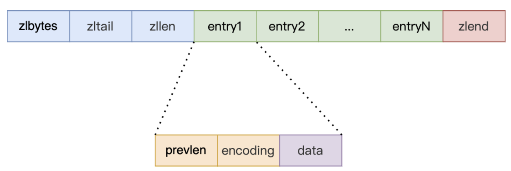

# redis中的数据结构
## 压缩列表
### 一、结构
ziplist本质是一块连续的内存空间，存储时节省内存消耗，因此创建函数中并没有实际的结构，创建代码如下。
下述代码可见，ziplist本身就是一块记录头、尾偏移、长度的连续内存空间，使用*zl指针返回。
```c
/* 创建一个新的空压缩列表。*/
unsigned char *ziplistNew(void) {
    unsigned int bytes = ZIPLIST_HEADER_SIZE+ZIPLIST_END_SIZE; // 计算压缩列表所需的总字节数
    unsigned char *zl = zmalloc(bytes); // 分配内存
    ZIPLIST_BYTES(zl) = intrev32ifbe(bytes); // 设置压缩列表的字节大小
    ZIPLIST_TAIL_OFFSET(zl) = intrev32ifbe(ZIPLIST_HEADER_SIZE); // 设置压缩列表尾节点的偏移量
    ZIPLIST_LENGTH(zl) = 0; // 设置压缩列表的节点数为0
    zl[bytes-1] = ZIP_END; // 在压缩列表的末尾设置结束标志
return zl; // 返回创建的压缩列表
}
```
结构体中，压缩列表节点的结构代码：
```c
/* 我们使用这个函数来接收有关压缩列表条目的信息。
 * 注意，这并不是数据实际编码的方式，只是我们通过一个函数填充的内容，以便更容易地操作。 */
typedef struct zlentry {
    unsigned int prevrawlensize; /* 用于编码前一个条目长度的字节数 */
    unsigned int prevrawlen;     /* 前一个条目的长度。 */
    unsigned int lensize;        /* 用于编码此条目类型/长度的字节数。
                                    例如，字符串有 1、2 或 5 个字节的头部。
                                    整数始终使用一个字节。*/
    unsigned int len;            /* 用于表示实际条目的字节数。
                                    对于字符串，这仅是字符串长度，
                                    而对于整数，根据数字范围，
                                    它可以是 1、2、3、4、8 或 0（4 位立即数）字节。*/
    unsigned int headersize;     /* prevrawlensize + lensize。 */
    unsigned char encoding;      /* 根据条目的编码方式设置为 ZIP_STR_* 或 ZIP_INT_*。
                                    但对于 4 位立即数整数，这可以是一系列值，并且必须进行范围检查。*/
    unsigned char *p;            /* 指向条目的起始位置，即指向前一个条目长度字段的位置。 */
} zlentry;
```
结构示例图：


ziplist在最新unstable分支中已经弃用，历史使用ziplist的redis数据结构。  
1.在3.2及以前版本，List结构在元素数量小于512且元素大小小于64字节时，使用ziplist。  
2.在5.0及以前版本，使用linkedlist+ziplist实现List结构。（分桶设计）  
3.在6.0及以前版本，Hash结构，元素数量较少时，采用ziplist+hashtable实现。  
4.在6.0及以前版本，zset结构少量元素场景下使用。  

在如下server.h的代码中截取的代码片段可知，zipmap、linkedlist、ziplist均不在使用。
```c
/* 对象编码。某些类型的对象，如字符串和哈希表，可以以多种方式进行内部表示。
 * 对象的 'encoding' 字段被设置为以下字段之一，表示此对象的编码方式。 */
#define OBJ_ENCODING_RAW 0             /* 原始表示方式 */
#define OBJ_ENCODING_INT 1             /* 编码为整数 */
#define OBJ_ENCODING_HT 2              /* 编码为哈希表 */
#define OBJ_ENCODING_ZIPMAP 3          /* 不再使用：旧的哈希编码方式 */
#define OBJ_ENCODING_LINKEDLIST 4      /* 不再使用：旧的列表编码方式 */
#define OBJ_ENCODING_ZIPLIST 5         /* 不再使用：旧的列表/哈希/有序集编码方式 */
#define OBJ_ENCODING_INTSET 6          /* 编码为整数集合 */
#define OBJ_ENCODING_SKIPLIST 7        /* 编码为跳跃表 */
#define OBJ_ENCODING_EMBSTR 8          /* 嵌入式 sds 字符串编码方式 */
#define OBJ_ENCODING_QUICKLIST 9       /* 编码为 listpack 的链表 */
#define OBJ_ENCODING_STREAM 10         /* 编码为 listpack 的基数树 */
#define OBJ_ENCODING_LISTPACK 11       /* 编码为 listpack */
```
### 二、特性
1.采用连续的存储空间，节约内存使用。
2.每个节点会保存前一个节点数据的长度。
3.保存数据处于临界长度时，节点数据的变更会导致连锁更新。
4.每次保存数据均需要扩容和分配内存，不适用与频繁存储和修改的场景。
5.在历史版本的redis的list、set、hash结构中均有使用，但目前已经废弃。
6.结构中使用了大量的编码约束，代码阅读比较困难。
7.查询收尾元素消耗O(1)时间复杂度，查询中间元素平均O(N)复杂度。
8.新增元素最差O(N)复杂度，且每次新增元素都需要从新分配内存，无法很好的适用大量数据存储和长数据存储。

### 三、部分函数源码
#### 3.1 ziplist插入元素函数
插入元素的函数实际就是不断调整指针，重新分配空间，插入数据，更新ziplist。且下方插入函数中，会调用一个__ziplistCascadeUpdate方法来级联的更新整个ziplist，即触发链式更新。
```c
/* 在 "p" 处插入项。*/
unsigned char *__ziplistInsert(unsigned char *zl, unsigned char *p, unsigned char *s, unsigned int slen) {
    size_t curlen = intrev32ifbe(ZIPLIST_BYTES(zl)), reqlen, newlen; // 获取当前压缩列表的字节数
    unsigned int prevlensize, prevlen = 0; // 前一个条目长度和所需字节数
    size_t offset; // 偏移量
    int nextdiff = 0; // 下一个条目长度变化
    unsigned char encoding = 0; // 条目编码
    long long value = 123456789; /* 初始化以避免警告。使用一个易于看出是否有未初始化使用的值。 */
    zlentry tail; // 尾节点信息

    /* 查找要插入的条目的 prevlen。*/
    if (p[0] != ZIP_END) {
        ZIP_DECODE_PREVLEN(p, prevlensize, prevlen); // 解码前一个条目的长度
    } else {
        unsigned char *ptail = ZIPLIST_ENTRY_TAIL(zl);
        if (ptail[0] != ZIP_END) {
            prevlen = zipRawEntryLengthSafe(zl, curlen, ptail); // 获取尾部条目的长度
        }
    }

    /* 检查是否可以对条目进行编码 */
    if (zipTryEncoding(s, slen, &value, &encoding)) {
        /* 'encoding' 被设置为适当的整数编码 */
        reqlen = zipIntSize(encoding); // 获取编码所需的字节数
    } else {
        /* 'encoding' 未更改，但 zipStoreEntryEncoding 将使用字符串长度来确定如何对其进行编码。*/
        reqlen = slen; // 使用字符串长度作为所需字节数
    }
    /* 我们需要空间来存储前一个条目的长度和有效负载的长度。*/
    reqlen += zipStorePrevEntryLength(NULL, prevlen); // 计算前一个条目长度所需的字节数
    reqlen += zipStoreEntryEncoding(NULL, encoding, slen); // 计算编码所需的字节数

    /* 当插入位置不等于尾部时，我们需要确保下一个条目可以容纳此条目的长度。*/
    int forcelarge = 0;
    nextdiff = (p[0] != ZIP_END) ? zipPrevLenByteDiff(p, reqlen) : 0; // 计算下一个条目长度的变化
    if (nextdiff == -4 && reqlen < 4) {
        nextdiff = 0;
        forcelarge = 1; // 如果需要强制使用大字节编码，设置为1
    }

    /* 存储偏移量，因为重新分配可能会改变 zl 的地址。*/
    offset = p - zl; // 记录插入位置的偏移量
    newlen = curlen + reqlen + nextdiff; // 计算新的压缩列表长度
    zl = ziplistResize(zl, newlen); // 调整压缩列表的大小
    p = zl + offset; // 更新插入位置

    /* 必要时应用内存移动并更新尾节点偏移量。*/
    if (p[0] != ZIP_END) {
        /* 减去一个字节是因为 ZIP_END 字节*/
        memmove(p + reqlen, p - nextdiff, curlen - offset - 1 + nextdiff); // 移动条目以腾出空间

        /* 在下一个条目中编码此条目的原始长度。*/
        if (forcelarge)
            zipStorePrevEntryLengthLarge(p + reqlen, reqlen); // 强制使用大字节编码
        else
            zipStorePrevEntryLength(p + reqlen, reqlen); // 存储前一个条目长度

        /* 更新尾节点偏移量 */
        ZIPLIST_TAIL_OFFSET(zl) =
            intrev32ifbe(intrev32ifbe(ZIPLIST_TAIL_OFFSET(zl)) + reqlen); // 更新尾节点偏移量

        /* 当尾部包含多个条目时，我们还需要考虑 "nextdiff"。否则，prevlen 大小的更改不会影响*尾部*偏移量。*/
        assert(zipEntrySafe(zl, newlen, p + reqlen, &tail, 1)); // 检查下一个条目的安全性
        if (p[reqlen + tail.headersize + tail.len] != ZIP_END) {
            ZIPLIST_TAIL_OFFSET(zl) =
                intrev32ifbe(intrev32ifbe(ZIPLIST_TAIL_OFFSET(zl)) + nextdiff); // 更新尾节点偏移量
        }
    } else {
        /* 这个元素将成为新的尾部。 */
        ZIPLIST_TAIL_OFFSET(zl) = intrev32ifbe(p - zl); // 更新尾节点偏移量
    }

    /* 当 nextdiff != 0 时，下一个条目的原始长度已更改，因此我们需要在整个压缩列表中级联更新。 */
    if (nextdiff != 0) {
        offset = p - zl; // 记录插入位置的偏移量
        zl = __ziplistCascadeUpdate(zl, p + reqlen); // 级联更新整个压缩列表
        p = zl + offset; // 更新插入位置
    }

    /* 写入条目 */
    p += zipStorePrevEntryLength(p, prevlen); // 存储前一个条目长度
    p += zipStoreEntryEncoding(p, encoding, slen); // 存储条目的编码方式
    if (ZIP_IS_STR(encoding)) {
        memcpy(p, s, slen); // 如果是字符串类型，复制字符串
    } else {
        zipSaveInteger(p, value, encoding); // 如果是整数类型，保存整数值
    }
    ZIPLIST_INCR_LENGTH(zl, 1); // 压缩列表长度加1
    return zl; // 返回更新后的压缩列表
}
```
#### 3.2 链式更新函数

```c
/* 当插入一个条目时，我们需要设置下一个条目的 prevlen 字段等于插入的条目的长度。
 * 可能会出现这样的情况，即这个长度无法在一个字节中编码，下一个条目需要略微增大以容纳 5 字节编码的 prevlen。
 * 这可以免费完成，因为这仅发生在已经插入条目（导致 realloc 和 memmove）时。
 * 然而，编码 prevlen 可能需要增大这个条目。当压缩列表中有接近 ZIP_BIG_PREVLEN 的大小的连续条目时，这种效应可能会在整个压缩列表中级联发生，
 * 因此我们需要检查 prevlen 是否可以在每个连续条目中编码。
 *
 * 请注意，这种效应也可能发生反向，即编码 prevlen 字段所需的字节可能会缩小。
 * 故意忽略这种效应，因为它可能导致“摇摆”效应，即链式 prevlen 字段首先增长，然后在连续插入之后再次缩小。
 * 相反，允许字段保持比实际需要更大，因为较大的 prevlen 字段意味着压缩列表已经包含较大的条目。
 *
 * 指针 "p" 指向第一个不需要更新的条目，即连续的字段可能需要更新。 */
unsigned char *__ziplistCascadeUpdate(unsigned char *zl, unsigned char *p) {
    zlentry cur;
    size_t prevlen, prevlensize, prevoffset; /* 上一个更改的条目的信息 */
    size_t firstentrylen; /* 用于处理在头部插入的情况 */
    size_t rawlen, curlen = intrev32ifbe(ZIPLIST_BYTES(zl));
    size_t extra = 0, cnt = 0, offset;
    size_t delta = 4; /* 更新一个条目的 prevlen 需要的额外字节数（5-1） */
    unsigned char *tail = zl + intrev32ifbe(ZIPLIST_TAIL_OFFSET(zl));

    /* 空压缩列表 */
    if (p[0] == ZIP_END) return zl;

    zipEntry(p, &cur); /* 不需要 "safe" 变体，因为输入指针由返回它的函数进行了验证。 */
    firstentrylen = prevlen = cur.headersize + cur.len;
    prevlensize = zipStorePrevEntryLength(NULL, prevlen);
    prevoffset = p - zl;
    p += prevlen;

    /* 迭代压缩列表以找出更新所需的额外字节数。 */
    while (p[0] != ZIP_END) {
        assert(zipEntrySafe(zl, curlen, p, &cur, 0));

        /* 当 "prevlen" 没有改变时中止。 */
        if (cur.prevrawlen == prevlen) break;

        /* 当条目的 "prevlensize" 足够大时中止。 */
        if (cur.prevrawlensize >= prevlensize) {
            if (cur.prevrawlensize == prevlensize) {
                zipStorePrevEntryLength(p, prevlen);
            } else {
                /* 这将导致缩小，我们要避免这种情况。
                 * 因此，在可用字节中设置 "prevlen"。 */
                zipStorePrevEntryLengthLarge(p, prevlen);
            }
            break;
        }

        /* cur.prevrawlen 意味着 cur 是前一个头部条目。 */
        assert(cur.prevrawlen == 0 || cur.prevrawlen + delta == prevlen);

        /* 更新前一个条目的信息并前进游标。 */
        rawlen = cur.headersize + cur.len;
        prevlen = rawlen + delta;
        prevlensize = zipStorePrevEntryLength(NULL, prevlen);
        prevoffset = p - zl;
        p += rawlen;
        extra += delta;
        cnt++;
    }

    /* 如果额外字节数为零，表示所有更新已完成（或不需要更新）。 */
    if (extra == 0) return zl;

    /* 循环结束后更新尾节点偏移量。 */
    if (tail == zl + prevoffset) {
        /* 当最后需要更新的条目也是尾部时，更新尾节点偏移量，除非这是唯一更新的条目（因此尾部偏移量没有变化）。 */
        if (extra - delta != 0) {
            ZIPLIST_TAIL_OFFSET(zl) =
                intrev32ifbe(intrev32ifbe(ZIPLIST_TAIL_OFFSET(zl)) + extra - delta);
        }
    } else {
        /* 在最后需要更新的条目不是尾部的情况下更新尾节点偏移量。 */
        ZIPLIST_TAIL_OFFSET(zl) =
            intrev32ifbe(intrev32ifbe(ZIPLIST_TAIL_OFFSET(zl)) + extra);
    }

    /* 现在 "p" 指向原始压缩列表中第一个未更改的字节，将其后的数据移动到新的压缩列表中。 */
    offset = p - zl;
    zl = ziplistResize(zl, curlen + extra);
    p = zl + offset;
    memmove(p + extra, p, curlen - offset - 1);
    p += extra;

    /* 从尾部到头部迭代所有需要更新的条目。 */
    while (cnt) {
        zipEntry(zl + prevoffset, &cur); /* 不需要 "safe" 变体，因为我们已经在上面迭代了所有这些条目。 */
        rawlen = cur.headersize + cur.len;
        /* 将条目移动到尾部并重置 prevlen。 */
        memmove(p - (rawlen - cur.prevrawlensize),
                zl + prevoffset + cur.prevrawlensize,
                rawlen - cur.prevrawlensize);
        p -= (rawlen + delta);
        if (cur.prevrawlen == 0) {
            /* "cur" 是前一个头部条目，将其 prevlen 更新为 firstentrylen。 */
            zipStorePrevEntryLength(p, firstentrylen);
        } else {
            /* 条目的 prevlen 只能增加 4 个字节。 */
            zipStorePrevEntryLength(p, cur.prevrawlen + delta);
        }
        /* 前进到前一个条目。 */
        prevoffset -= cur.prevrawlen;
        cnt--;
    }
    return zl;
}
```


### 四、应用
历史版本的list、set、hash中，在6.0之后的版本，已经被listpack所替代。