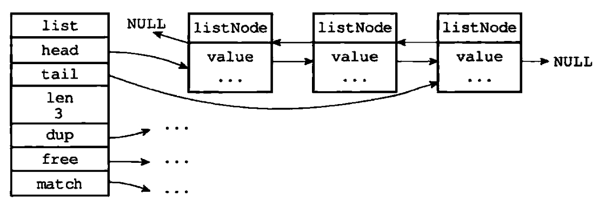

# redis中的数据结构
## 链表
### 一、结构
由于c的标准库中不包含链表数据结构，redis自己实现了一个链表结构的数据对象，包含两个部分：listNode(链表节点)和list(链表)。  
在《redis设计于实现》一书中，listNode和list结构如下(基于redis3.0版本)，并且在redis最新unstable分支源码中，结构与3.0版本相同。
```c
typedef struct listNode {
    struct listNode *prev; // 前置节点
    struct listNode *next;  // 后置节点
    void *value;  // 节点值
} listNode;

typedef struct list {
    listNode *head; // 头节点
    listNode *tail; //尾节点
    void *(*dup)(void *ptr); //节点值的复制函数
    void (*free)(void *ptr);  //节点值的释放函数
    int (*match)(void *ptr, void *key); // 节点值的对比函数
    unsigned long len; //链表长度（包含的节点数）
} list;
```
list用于简化listNode的操作，他保存了头尾两个节点，配合listNode组成了双端链表。


除了上述两个结构外，redis的链表还实现了迭代器结构，用于循环链表数据。
```c
typedef struct listIter {
    listNode *next; // 下一个节点
    int direction; //控制方向，AL_START_HEAD 0 头开始，向后访问/AL_START_TAIL 1 尾开始，向前访问
} listIter;
```
### 二、特性
1. 双端链表：结构存在prev和next指针，访问前后节点时间复杂度均为O(1)。
2. 非环：头节点和尾节点均指向null,非闭合换状结构。
3. list结构携带表头和表位指针：获取表头和表尾时间复杂度均为O(1)。
4. 链表记录长度：获取链表长度的时间复杂度为O(1)。
5. 多态：链表节点使用void*指针保存节点值，并且可通过list结构的dup、free、match三个属性节点设置类型的特定函数，可保存不同类型的值。
缺陷：
1.内存不连续，无法利用cpu缓存，缓存根据机器的架构如果是x64，则会连续加载一段内存缓存到cpu（数组是连续内存）。
2.每个链表节点都需要节点结构头，内存消耗大。
3.查询效率低，平均O(n)。
### 三、部分函数源码
redis的链表包含诸多操作函数，此处摘取部分源码进行说明。
#### 3.1 创建链表函数
```c
/* 创建链表的方法，创建失败则返回null
 * 默认头、尾、dup、free、match属性都为nunll，len为0
 */
list *listCreate(void)
{
    struct list *list;

    if ((list = zmalloc(sizeof(*list))) == NULL)
        return NULL;
    list->head = list->tail = NULL;
    list->len = 0;
    list->dup = NULL;
    list->free = NULL;
    list->match = NULL;
    return list;
}
```
#### 3.2 清空链表函数
清空链表函数为listRelease,从unstable分支截取源码如下。  
listRelease调用了listEmpty函数，后者循环调用每个节点的free属性赋值的函数执行节点自己的释放。
因此链表的listCreate方法注释：“The created list can be freed with listRelease(), but private value of every node need to be freed by the user before to call listRelease(), or by setting a free method using listSetFreeMethod.”  
翻译过来就是，释放list可以使用listRelease函数，但是如果没有给节点设置free属性（使用listSetFreeMethod设置free属性），则最好在释放链表前，将每个节点的内部数据释放。
```c
void listRelease(list *list)
{
    if (!list)
        return;
    listEmpty(list);
    zfree(list);
}

void listEmpty(list *list)
{
    unsigned long len;
    listNode *current, *next;

    current = list->head;
    len = list->len;
    while(len--) {
        next = current->next;
        if (list->free) list->free(current->value);
        zfree(current);
        current = next;
    }
    list->head = list->tail = NULL;
    list->len = 0;
}

```
#### 3.3 添加节点函数
添加节点包含五个函数，分别为：向头部添加（传入值和节点两种，共2个）、向尾部添加（传入值和节点两种，共两个）、加入到某个节点前后。
由下方函数可知，listNode的首节点和尾节点不会闭合成环。
```c
/* 向头部添加，传入值 */
list *listAddNodeHead(list *list, void *value)
{
    listNode *node;

    if ((node = zmalloc(sizeof(*node))) == NULL)
        return NULL;
    node->value = value;
    listLinkNodeHead(list, node);
    return list;
}

/* 向头部添加，传入节点 */
void listLinkNodeHead(list* list, listNode *node) {
    if (list->len == 0) {
        list->head = list->tail = node;
        node->prev = node->next = NULL; // 不会闭合成环
    } else {
        node->prev = NULL; // 不会闭合成环
        node->next = list->head;
        list->head->prev = node;
        list->head = node;
    }
    list->len++; // 长度计数+1
}

/* 向尾部添加，传入值 */
list *listAddNodeTail(list *list, void *value)
{
    listNode *node;

    if ((node = zmalloc(sizeof(*node))) == NULL)
        return NULL;
    node->value = value;
    listLinkNodeTail(list, node);
    return list;
}

/* 向尾部添加，传入节点 */
void listLinkNodeTail(list *list, listNode *node) {
    if (list->len == 0) {
        list->head = list->tail = node;
        node->prev = node->next = NULL;
    } else {
        node->prev = list->tail;
        node->next = NULL;
        list->tail->next = node;
        list->tail = node;
    }
    list->len++;
}

/* 加入到某个节点前后
 * 如果after不为0,则将节点插入到old节点之后，繁殖插入到old节点之前，因为给入了待插入节点和锚点节点，时间复杂度为O(1)。
 * */
list *listInsertNode(list *list, listNode *old_node, void *value, int after) {
    listNode *node;

    if ((node = zmalloc(sizeof(*node))) == NULL)
        return NULL;
    node->value = value;
    if (after) {
        node->prev = old_node;
        node->next = old_node->next;
        if (list->tail == old_node) {
            list->tail = node;
        }
    } else {
        node->next = old_node;
        node->prev = old_node->prev;
        if (list->head == old_node) {
            list->head = node;
        }
    }
    if (node->prev != NULL) {
        node->prev->next = node;
    }
    if (node->next != NULL) {
        node->next->prev = node;
    }
    list->len++;
    return list;
}

```
#### 3.4 移除节点函数
移除节点包含两个函数，listDelNode和listUnlinkNode，前者会调用前者。  
listDelNode会移除某一个节点，并调用节点的free属性释放空间，listUnlinkNode只会断链。
```c
void listDelNode(list *list, listNode *node)
{
    listUnlinkNode(list, node);
    if (list->free) list->free(node->value);
    zfree(node);
}

void listUnlinkNode(list *list, listNode *node) {
    if (node->prev)
        node->prev->next = node->next;
    else
        list->head = node->next;
    if (node->next)
        node->next->prev = node->prev;
    else
        list->tail = node->prev;

    node->next = NULL;
    node->prev = NULL;

    list->len--;
}
```
#### 3.5 函数差异
最新unstable分支相较《redis设计与实现》一书中的3.0版本,链表结构中新增了listRotateTailToHead、listRotateHeadToTail、listJoin等函数
其他函数说明待后续补充。
### 四、应用
列表键、发布订阅模块、慢查询、监视器、客户端信息、客户端输出缓冲区等功能均用到链表。